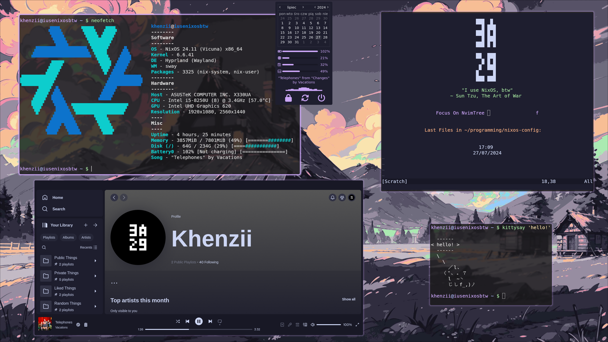

## nixos-config 

This repository contains my working environment config. It consists of:

1. nixos config (placed in `nixos/`, `home-manager/` & `shared/`) 
2. dotfiles (placed in `dotfiles/`)

It thoroughly defines every single tweak that I've made to any program that's running on my machine.

## Features

<div align="center">
  
</div>

The whole OS is centered around Catppuccin Mocha Mauve theme. Lots of applications are configured to match this color pallete, some examples include:

- shell - [zsh](https://github.com/zsh-users/zsh),
- desktop environment - [hyprland](https://github.com/hyprwm/Hyprland),
- code editor - [neovim](https://github.com/neovim/neovim),
- app launcher - [rofi](https://github.com/adi1090x/rofi),
- bar / desktop widgets - [eww](https://github.com/elkowar/eww),
- and much more!

Other than that, this config is also integrated with [catppuccin/nix](https://github.com/catppuccin/nix); which regularly adds support for more apps.

## Usage

- ALT + S / Print Screen - Screenshot,
- ALT + R - App Launcher,
- ALT + W - Change Wallpaper,
- ALT + A - Lock,
- ALT + E - Toggle Window Split (Horizontal / Vertical),
- ALT + F - Start Browser,
- ALT + T - Start Terminal,
- ALT + L - Change Workspace (Direction: Right),
- ALT + H - Change Workspace (Direction: Left),
- ALT + Q - Kill Active Window,
- ALT + V - Make Active Window Float,
- ALT + RMB - Resize Active Window,
- ALT + LMB - Move Active Window,
- SUPER + L - Change Workspace With Active Window (Direction: Right),
- SUPER + H - Change Workspace With Active Window (Direction: Left),

### Neovim Tips

Checkout `dotfiles/.config/nvim/README.md`. It covers those topics:

1. Keybindings
2. Plugins
3. Languages Support
4. Code Formatting

If you have more questions, feel free to reach out to me!

## Documentation

Every previously mentioned module (`nixos/`, `home-manager/`, `shared/`, `dotfiles/`) has it's own docs placed in `<module_name>/README.md`. If you're going to read them, the recommended order is:

1. `dotfiles/`
2. `nixos/`
3. `home-manager/`
4. `shared/`

If you're not familiar with Nix, checkout [this](https://nixos.org/) page; in short, NixOS is a opinionated Linux distro which focuses on reproducibility. Nix is both a package manager, and a programming language at the same time.

## Installation

You can setup this configuration in many different ways.

### Using The Installer (`install.sh`)

I have written a minimal script for linking the dotfiles and switching to the NixOS configuration:

```shell
$ curl https://raw.githubusercontent.com/Khenziii/nixos-config/master/install.sh > install.sh && sudo chmod +x install.sh && sudo ./install.sh && rm -f install.sh
```

> [!TIP]
> Running this script, requires having `git` and `stow` installed. If you're on NixOS, you can temporarily enter a shell session with them available using this command: 
> 
> ```shell
> $ nix-shell -p git stow 
> ```


> [!TIP]
> By default, the script shows a warning requesting the user to make sure that they want to proceed at startup. To override it, you can pass `y` as the first parameter when calling the script:
>
> ```shell
> $ curl https://raw.githubusercontent.com/Khenziii/nixos-config/master/install.sh > install.sh && sudo chmod +x install.sh && sudo ./install.sh y && rm -f install.sh
> ```

> [!CAUTION]
> `curl`'ing a file like this and executing it as root without necessary attention is extremely dangerous.
>
> **make sure to read the content of this script before running it!!! <https://raw.githubusercontent.com/Khenziii/nixos-config/master/install.sh>**

### Manually

If you don't want to run a random script originating from a random github repo (which is totally understandable, I'd be cautious too), you can execute the commands yourself:

```shell
$ git clone https://github.com/Khenziii/nixos-config
$ cd nixos-config
$ stow --no-folding --adopt -t ~ dotfiles
$ touch ~/.config/hypr/monitors.conf
$ touch ~/.config/hypr/workspaces.conf
$ sudo nixos-generate-config
$ sudo nixos-rebuild switch --flake ".#iusenixosbtw" --impure
$ home-manager switch --flake ".#khenzii"
```

`monitors.conf` and `workspaces.conf` are both files created by `nwg-displays` (output configuration utility). They're imported from `hyprland.conf`, so we create empty placeholders to avoid errors. 

## 

Remember, there's nothing stopping you from using the code however you like to! It's licensed under `GPL-3.0`. If you want to, you can use only the dotfiles like this:

```shell
$ git clone https://github.com/Khenziii/nixos-config
$ cd nixos-config
$ stow --no-folding --adopt -t ~ dotfiles
$ touch ~/.config/hypr/monitors.conf
$ touch ~/.config/hypr/workspaces.conf
```

The choice is up to you!

